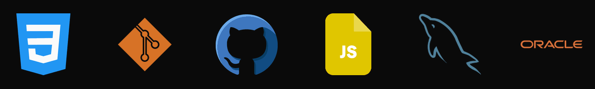

 

  

  

<h2><strong>About Me</strong></h2>

I'm a Computer Systems Engineering student interested in software development,
databases, artificial intelligence and technology.

I enjoy learning new technologies, developing applications and creating solutions through technology.

 

  

<h2><strong>Languages & Tools I Use</strong></h2>

 

  

<h2><strong>Areas of Focus</strong></h2>

  

<h2><strong>Let's Connect</strong></h2>

 

 

